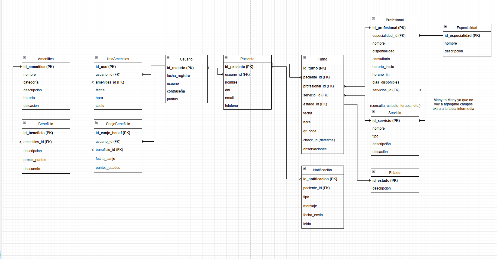

El sistema busca gestionar turnos médicos en una clínica y complementar la experiencia del paciente ofreciéndole amenities y servicios adicionales que puede utilizar antes o después de su atención.
El sistema está pensado para cubrir el proceso completo del paciente, desde la reserva del turno hasta su permanencia en la clínica.

