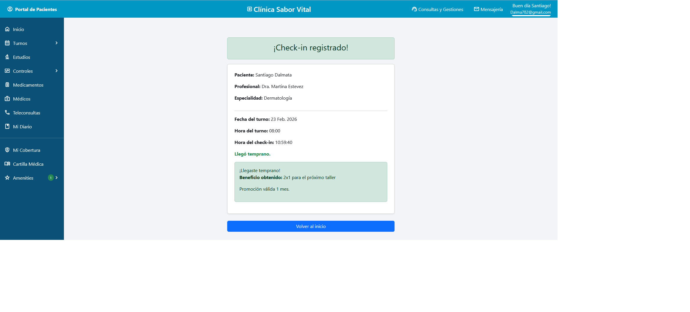

El sistema está diseñado para gestionar los turnos médicos de una clínica y ofrecer amenities y servicios adicionales que el cliente puede disfrutar antes o después de su consulta. Su objetivo es acompañar todo el recorrido del paciente, desde la reserva del turno hasta su estadía dentro de la clínica para un servicio extra.

Diagrama Entidad Relación del proyecto:

En funcionamiento:

